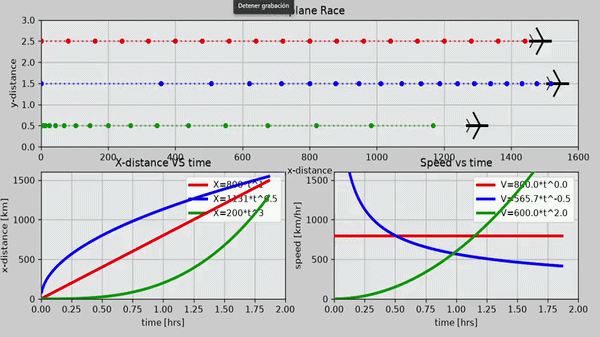

# FlightSimulatorAnimation

Air race simulation + Mach number extension with ISA atmosphere.

### Demo


### Final Structure
FlightSimulatorAnimation/
├── race/ # Original base - Mark Misin License
│ ├── config/
│ │ └── airplane_config.py # AirplaneConfig (a, n, altitude)
│ └── models/
│ ├── airplane_race.py # Artist + physics X=a_t^n, V=n_a*t^(n-1)
│ └── race_airplanes.py # Definition of the 3 race airplanes
│
├── Speed/ # My extension - Mach calculation
│ ├── config/
│ │ ├── constants.py # Airplane OFFSETS + ISA constants
│ │ └── data.py # c(h) and Mach = V / c calculation
│ ├── managers/
│ │ ├── air_manager.py
│ │ ├── building_manager.py
│ │ ├── graph_manager.py
│ │ ├── text_manager.py
│ │ └── trail_manager.py
│ ├── models/
│ │ ├── airplane_speed.py # Pure renderer, receives (x,y) from data.py
│ │ ├── text_elements.py
│ │ └── trail.py
│ ├── plots/
│ │ └── animator.py
│ └── speed.py # Speed entry point
│
├── assets/
│ └── race.gif
├── requirements.txt
└── README.md


### Why two airplane files?

Not duplicated code, different responsibilities:

- `race/models/airplane_race.py`: Coupled model. Contains physics `X=a*t^n` and rendering `SHAPE = [BODY, WING...]`. Optimized, vectorized version of the original race.

- `Speed/models/airplane_speed.py`: Decoupled model. **Renders only**. Uses `OFFSETS` from `constants.py` and a parts `dict`. Physics and Mach logic live in `Speed/config/data.py`. This pattern allows `graph_manager` and `trail_manager` to handle it.

### Physics

- Race: `X(t)=a*t^n`, `V(t)=n*a*t^(n-1)`
- Speed: `M(t)=V(t)/c(h)`, with `c(h)` from ISA atmosphere

### Run

```bash
pip install -r requirements.txt
python Speed/speed.py # Original file done in functions by me
python race/race_airplanes.py # Original race done in POO by me
```

Roadmap3-airplane raceManager architectureMach vs time plot[x]
Original concept © Mark Misin Engineering. Race  and Speed respects original license. 